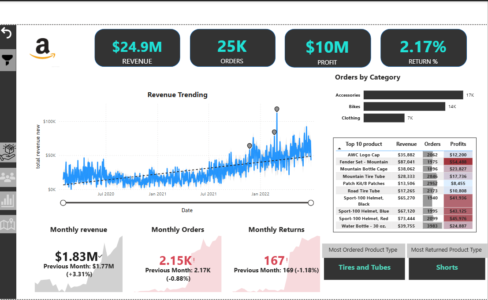
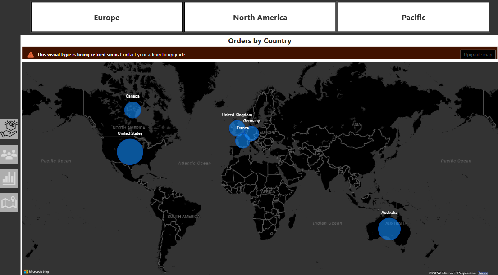
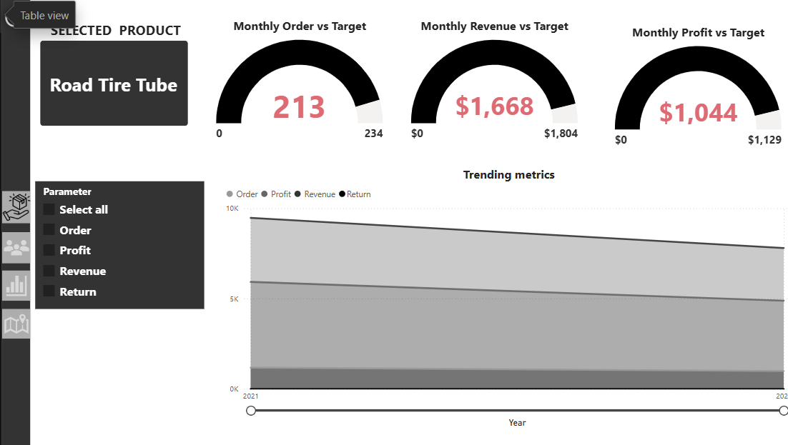
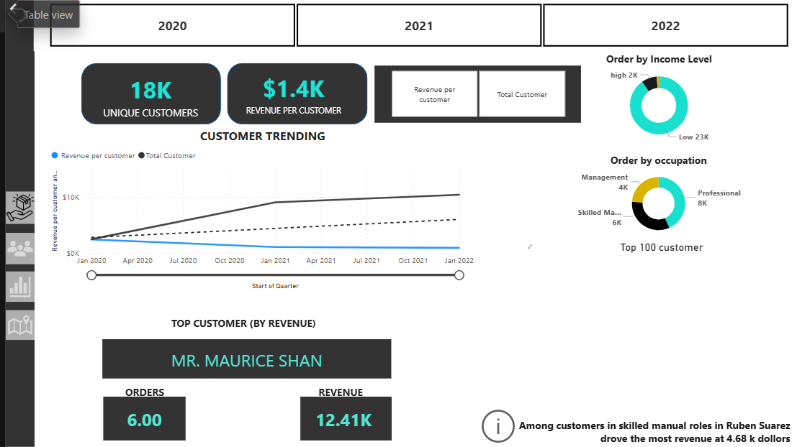

# Amazon-Dashboard
# Power BI Dashboard

## Project Overview
This project analyzes sales, customer behavior, product performance, and regional trends using Power BI.

The dashboard was built using the AdventureWorks dataset and focuses on interactive business intelligence reporting.

---

## Tools Used
- Power BI
- DAX
- Power Query
- Excel

---

## Key Features
- Revenue and profit analysis
- Order return tracking
- Regional sales analysis using maps
- Product performance monitoring
- Customer trend analysis
- Interactive slicers and filters

---

## Dashboard Pages

### 1. Sales Overview
- Revenue: $24.9M
- Orders: 25K
- Profit: $10M
- Return Rate: 2.17%

### 2. Regional Analysis
- Country-wise order visualization
- Region filtering (Europe, North America, Pacific)

### 3. Product Performance
- Monthly targets vs actual performance
- Product trend metrics
- Revenue and profit tracking

### 4. Customer Insights
- Revenue per customer
- Customer segmentation
- Occupation and income-level analysis

---

## Dashboard Screenshots

### Sales Overview

### Regional Analysis

### Product Performance

### Customer Insights

---

## Business Insights
- Accessories generated the highest order volume
- North America contributed the largest share of orders
- Revenue trends increased significantly after 2021
- Customer segmentation helped identify high-value buyers
